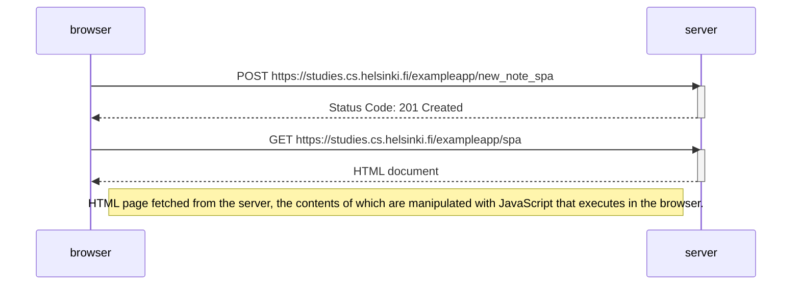

```mermaid
sequenceDiagram
    participant browser
    participant server

    browser->>server: POST https://studies.cs.helsinki.fi/exampleapp/new_note_spa
    activate server
    server-->>browser: Status Code: 201 Created
    deactivate server

    browser->>server: GET https://studies.cs.helsinki.fi/exampleapp/spa
    activate server
    server-->>browser: HTML document
    deactivate server

    Note right of browser: HTML page fetched from the server, the contents of which are manipulated with JavaScript that executes in the browser.
```
